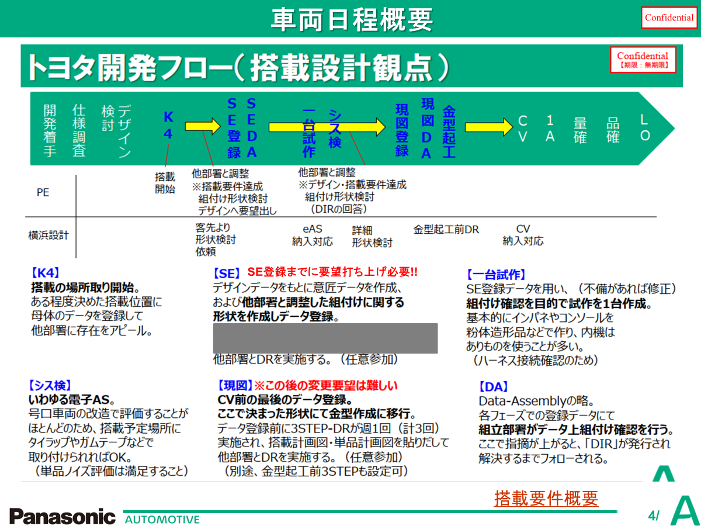

*TOYOTAの開発フェーズは、独特な専門用語が多い。。*
K4⇒SE⇒EAS⇒現図⇒CV⇒１A⇒量確⇒品確⇒LO

### K4（構造計画　KouzouKeiKaKu）  
２D図面上で内部の確認
### SE
実際に中身を大まかに作っていく
（ダクトをどこ通すか、パネルの爪をどこにするか、どういう形状にするか　など）
### FDS （不具合出し切りステージ　FuguaiDashikiriStage）
（見栄えDA、組立DA）　
設計が作ったデータで見栄え大丈夫か、組み立て大丈夫か、
隙からの板金見えなどを設計以外の部署（組み立てやデザイン、車品性など）が確認
### 現図
FDSで上がった指摘を折り込む

---
### 関連ノート
- [[toyota-term-24cy-naiki|R-TOYOTA_用語_24CY内機]]
- [[toyota-term-dr|R-TOYOTA_用語_DR]]
- [[toyota-term-rddp|R-TOYOTA_用語_RDDP]]
- [[toyota-term-gaisetsushin|R-TOYOTA_用語_外設申]]
- [[toyota-term-shikyu|R-TOYOTA_用語_支給]]
- [[toyota-term-kanri-jikyu|R-TOYOTA_用語_管理自給]]
- [[p-24cy-400d|P-24CY-400D]]
- [[p-24cy-310d|P-24CY_310D]]
- [[p-24cy-410d|P-24CY_410D]]
- [[p-24cy-695d-696d|P-24CY_695D_696D]]
- [[p-24cy-744d|P-24CY_744D]]
- [[p-24cy-744d-summary|P-24CY_744D_summary]]
- [[825d-overview|P-24CY_825D]]
- [[2025-12-11_1sdr-review|P-24CY_825D_1SDR_議事録]]
- [[2025-09-29_dr0-drbfm-review-part1|P-24CY_825D_DR0_DRBFM_review_part1]]
- [[2025-09-29_dr0-drbfm-review-part2|P-24CY_825D_DR0_DRBFM_review_part2]]
