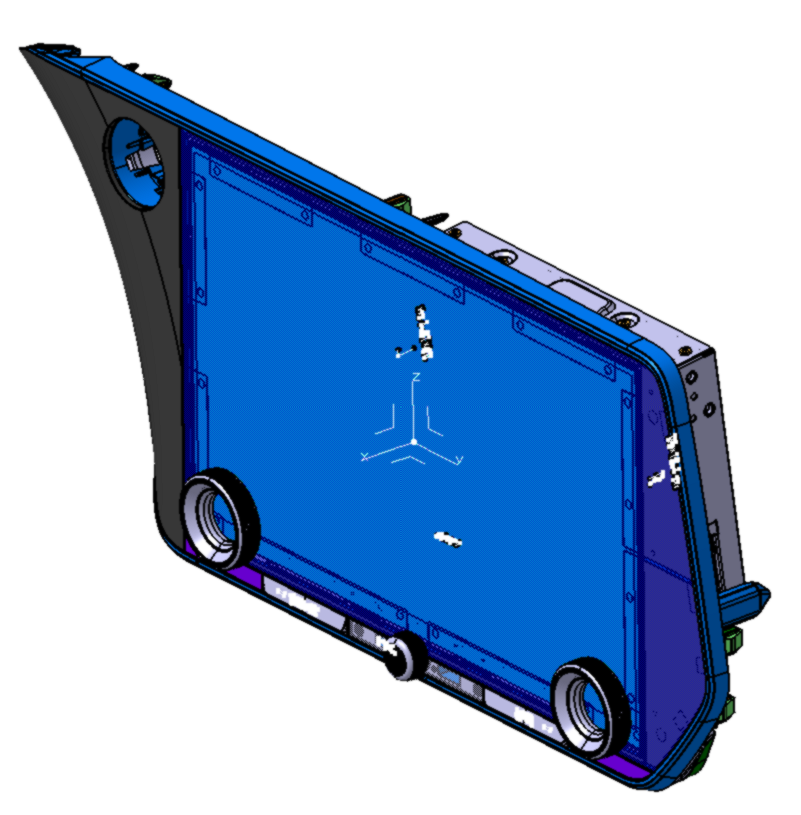

# 220D

## 概要 (Overview)
| 項目         | 内容              | 備考       |
| ---------- | --------------- | -------- |
| **基本情報**   |                 |          |
| 開発コード      | -               | PASA案件   |
| 製品品番       |                 |          |
| サイクル年 (CY) | 21CY            |          |
| **車両情報**   |                 |          |
| 搭載車種       | Lexus NX        |          |
| 仕向け地       | NA              |          |
| **HW仕様**   |                 |          |
| Displayサイズ | 14              |          |
| SoC        |                 |          |
| 内機タイプ      | 縦置き             |          |
| **担当情報**   |                 |          |
| 顧客担当       |                 |          |
| 社内担当 (機構)  | PASA            |          |
| 社内担当 (電気)  |                 |          |
| 社内担当 (ソフト) |                 |          |
| **生産情報**   |                 |          |
| 生産拠点       | MX              |          |
| 納入先        |                 |          |
| **関連機種**   |                 |          |
| 派生元機種      | 910B            |          |
| 後継機種       | [[825d-overview|P-24CY_825D]] | ボタン、ノブ廃止 |

## プロジェクト目標 (Project Goals)
- 14インチ IVI。21CY LEXUS LXに搭載。

## 主要サプライヤ (Key Suppliers)
| 部品 | メーカー | 備考 |
| --- | --- | --- |
| ガラス | | |
| ボンディング | | |
| FPC | | |
| バックライト | | |
| その他 | | |

## 開発マイルストーン & イベント (Development Milestones & Events)
| 日付 | イベント名 | ステータス | 関連資料 |
| --- | --- | --- | --- |
| `YYYY-MM-DD` | | | |

## リスクと課題 (Risks & Issues)
- 

## 関連ノート (Related Notes)
- [[p-24cy-410d|P-24CY_410D]]
- [[p-21cy-450d|P-21CY_450D]]
- [[p-21cy-900b|P-21CY_900B]]

## データパス (Data Paths)
- **CADデータ:** 
- **仕様書:**

---
### 関連ノート
- P-IVI_template
- [[glass-slimming|R-技術_スリミング_ガラス]]
- [[p-24cy-400d|P-24CY-400D]]
- [[p-24cy-310d|P-24CY_310D]]
- [[p-24cy-695d-696d|P-24CY_695D_696D]]
- [[p-24cy-744d|P-24CY_744D]]
- [[p-24cy-744d-summary|P-24CY_744D_summary]]
- [[2025-12-11_1sdr-review|P-24CY_825D_1SDR_議事録]]
- [[2025-09-29_dr0-drbfm-review-part1|P-24CY_825D_DR0_DRBFM_review_part1]]
- [[2025-09-29_dr0-drbfm-review-part2|P-24CY_825D_DR0_DRBFM_review_part2]]
- [[dr0-issues-summary|P-24CY_825D_DR0_issues_summary]]
- [[2025-09-16_drb-review|P-24CY_825D_DRB_review]]
