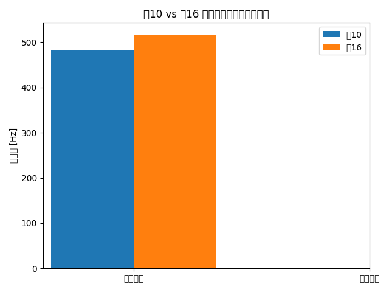

# 案16解析レポート

## 概要
本レポートでは、IPONC形状案10に補強形状を追加した案16について、解析結果を案10と比較し、振動耐性の向上を評価します。

---

## 案10 vs 案16 固有値比較

| 案番号 | 前後方向固有値 (Hz) | 左右方向固有値 (Hz) |
|--------|----------------------|----------------------|
| 案10   | 483.8             | 86.3             |
| 案16   | 517.4             | 119.1             |

補強形状の追加により、案16では前後方向で約33.6Hz、左右方向で約32.8Hzの向上が見られ、振動耐性が改善されています。

---

## 考察

- **補強追加の効果**：案16は案10に比べて固有値が向上しており、補強形状の追加が振動耐性に寄与していることが確認できます。
- **実機試験との相関**：解析値と実測値の差が小さく、特に左右方向では相関が取れていることがコメントでも言及されています。
- **今後の展望**：
  - 補強形状の最適化（軽量化・コスト削減）
  - 異方性材料解析の導入
  - 実機との整合性向上
  - 造形・試作フェーズへの移行

---

## グラフ

以下のグラフは案10と案16の固有値（前後・左右方向）を比較したものです。

---
### 関連ノート
- [[p-iponc-20250123-report|P-IPONC_20250123_Report]]
- [[p-iponc-3|P-IPONC_3回目_スライド原稿（案）]]
- [[p-iponc-presentation-script|P-IPONC_presentation_script]]
- [[p-iponc-slide-strategy|P-IPONC_slide_strategy]]
- [[p-iponc|P-IPONC_市原さん発言内容]]
- [[a-202508-1|A-202508_月業務レポート_その1_要約]]
- [[iponc-screw-essence|R-技術_IPONC_ネジの本質]]
- [[onyx-surface-smoothing-report|R-技術_Onyx表面平滑化_レポート]]
